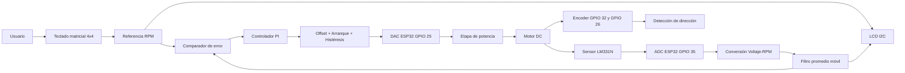
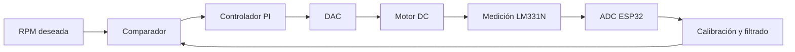

# LAB2_MICROS
# Comparación MicroPython vs Arduino IDE

## Sistema de control de velocidad con ESP32

El sistema de control de velocidad del motor DC fue desarrollado en dos entornos de programación diferentes: **MicroPython** y **Arduino IDE**. Ambas implementaciones utilizan el mismo hardware y la misma estrategia de control basada en un **controlador PI en lazo cerrado**.

El objetivo del sistema es controlar la velocidad del motor mediante una referencia ingresada por el usuario utilizando un teclado matricial 4x4. La velocidad real del motor es obtenida mediante un circuito de medición basado en **LM331N**, cuya señal es adquirida por el ADC del ESP32. Posteriormente, esta información es procesada y utilizada por el controlador PI para modificar la salida DAC que controla la etapa de potencia del motor.

---

# Comparación de implementaciones

| Característica | MicroPython | Arduino IDE |
|---|---|---|
| Lenguaje de programación | Python | C++ |
| Microcontrolador | ESP32 | ESP32 |
| Entrada analógica | GPIO 35 | GPIO 35 |
| Resolución ADC | 12 bits | 12 bits |
| Salida de control DAC | GPIO 25 | GPIO 25 |
| Pantalla utilizada | LCD I2C 16x2 dirección 0x27 | LCD I2C 16x2 dirección 0x27 |
| Teclado | Matricial 4x4 | Matricial 4x4 |
| Encoder | GPIO 32 y GPIO 26 | GPIO 32 y GPIO 26 |
| Periodo de actualización | 200 ms | 200 ms |
| Controlador implementado | PI | PI |
| Ganancia proporcional | Kp = 0.25 | Kp = 0.25 |
| Ganancia integral | Ki = 0.02 | Ki = 0.02 |
| Filtrado de señal | Promedio móvil de 10 muestras | Promedio móvil de 10 muestras |
| Rango de operación | 0 a 3000 RPM | 0 a 3000 RPM |

---

# Implementación en MicroPython

La versión desarrollada en MicroPython permite una programación más sencilla y flexible, facilitando la modificación del algoritmo durante las pruebas experimentales.

La configuración de los periféricos del ESP32 se realiza mediante la librería `machine`, permitiendo controlar:

- ADC para adquisición de la señal del LM331N.
- DAC para generar la señal de control del motor.
- Comunicación I2C con la pantalla LCD.
- Entradas digitales para el encoder.

El sistema utiliza las funciones:

```python
ticks_ms()
ticks_diff()
````

para realizar la ejecución periódica del controlador cada 200 ms.

La salida del controlador PI se entrega al DAC mediante:

```python
dac.write(valor)
```

Esta implementación facilita la modificación de parámetros como ganancias del controlador, filtros y compensaciones debido a la simplicidad del lenguaje.

---

# Implementación en Arduino IDE

La versión desarrollada en Arduino IDE utiliza lenguaje C++ y permite un manejo más cercano al hardware del ESP32.

Se utilizan las librerías:

```cpp
Keypad.h
Wire.h
LiquidCrystal_I2C.h
```

El control temporal del sistema se realiza mediante:

```cpp
millis()
```

permitiendo ejecutar el algoritmo de control sin detener la ejecución del programa principal.

La salida DAC hacia la etapa de potencia se genera mediante:

```cpp
dacWrite(PIN_DAC, valor);
```

Una ventaja de esta implementación es la facilidad de depuración mediante el monitor serial, donde se pueden observar variables como:

* Lectura ADC.
* Voltaje medido.
* RPM calculadas.
* RPM deseadas.
* Dirección del motor.

---

# Funcionamiento del sistema

Ambas versiones implementan la misma secuencia de control:

1. El usuario ingresa la velocidad deseada mediante el teclado matricial 4x4.

2. El ESP32 almacena la referencia de velocidad y la compara con la velocidad medida del motor.

3. La señal proveniente del circuito LM331N ingresa al ADC del ESP32 por el pin GPIO 35.

4. La lectura del ADC se convierte a voltaje mediante:

$$
V=\frac{ADC}{4095}\times3.3
$$

5. El voltaje obtenido se convierte a velocidad utilizando la calibración experimental:

$$
RPM = 769V - 153
$$

6. La señal obtenida se filtra mediante un promedio móvil de 10 muestras para disminuir el ruido generado durante la medición.

7. Se calcula el error del sistema:

$$
Error = RPM_{deseada}-RPM_{medida}
$$

8. El controlador PI procesa el error:

$$
u(t)=K_p e(t)+K_i\int e(t)dt
$$

donde:

$$
K_p=0.25
$$

$$
K_i=0.02
$$

9. La salida del controlador modifica el valor DAC del ESP32.

10. La nueva velocidad del motor es medida nuevamente, cerrando el lazo de control.

---

# Estrategias adicionales implementadas

## Impulso de arranque

Para superar la inercia inicial del motor se implementa un impulso temporal de arranque.

Condiciones:

* Velocidad medida menor a 400 RPM.
* Tiempo máximo de aplicación: 2 segundos.

Valor aplicado:

```
DAC = 200
```

Esta estrategia permite que el motor alcance el movimiento inicial antes de entrar completamente en el control PI.

---

## Offset dinámico

Debido a que el motor necesita una señal mínima para comenzar a girar, se implementa un offset dependiendo de la velocidad solicitada.

```
RPM < 600  → Offset DAC = 130

RPM >= 600 → Offset DAC = 110
```

Esto mejora la respuesta del sistema en bajas velocidades.

---

## Histéresis y salida mínima

Para evitar que el motor se detenga cuando la señal de control disminuye demasiado, se establece una condición mínima de mantenimiento:

```
Si RPM medida > 200 RPM

Salida mínima DAC = 80
```

Además, se establece un límite inferior dinámico:

```
RPM < 600 RPM  → DAC mínimo = 100

RPM >= 600 RPM → DAC mínimo = 40
```

---

# Diagrama de bloques del sistema



---

# Lazo cerrado de control



---

# Distribución del teclado

| Tecla | Función                           |
| ----- | --------------------------------- |
| 0-9   | Ingreso de velocidad deseada      |
| #     | Confirmar velocidad               |
| *     | Borrar entrada                    |
| A-D   | Reservadas para futuras funciones |

---

# Parámetros principales del sistema

```
Microcontrolador:
ESP32

Velocidad máxima:
3000 RPM

Periodo de actualización:
200 ms

ADC:
GPIO 35
Resolución: 12 bits

DAC:
GPIO 25

Encoder:
Canal A GPIO 32
Canal B GPIO 26

Control PI:
Kp = 0.25
Ki = 0.02

Filtro:
Promedio móvil de 10 muestras

Calibración:
RPM = 769V - 153
```

---

# Conclusión

Las implementaciones realizadas en MicroPython y Arduino IDE presentan el mismo comportamiento debido a que utilizan la misma configuración de hardware y el mismo algoritmo de control.

La versión en MicroPython permite realizar modificaciones rápidas durante la etapa experimental, mientras que Arduino IDE proporciona una implementación más orientada al desarrollo embebido y facilita la depuración mediante comunicación serial.

Ambas versiones permiten controlar la velocidad del motor mediante un sistema de realimentación, donde la velocidad medida es comparada continuamente con la referencia ingresada por el usuario para ajustar la salida DAC del ESP32 y mantener la velocidad deseada.

```
```

- Salida DAC mediante:

```python
dac.write(valor)
